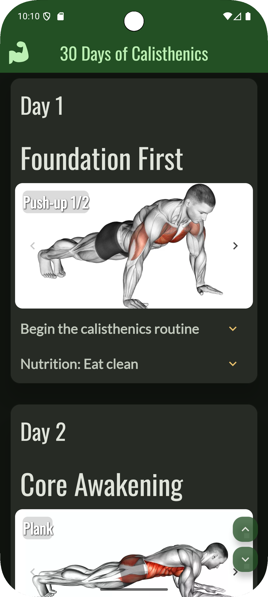
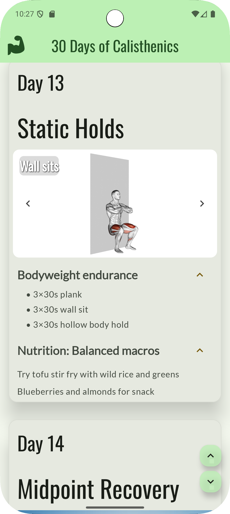
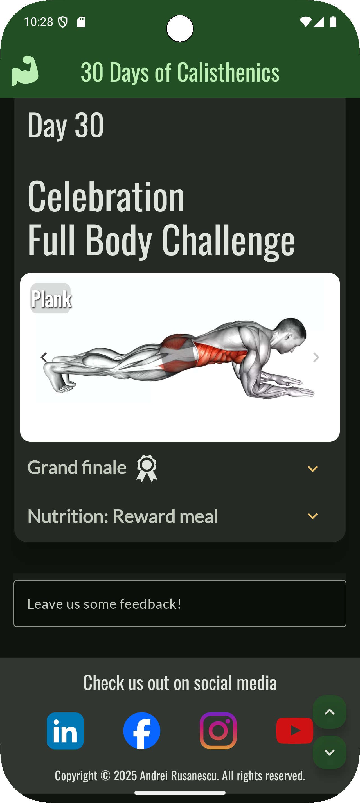

# 🏋️ 30 Days of Calisthenics

**30 Days of Calisthenics** is an Android app built with **Jetpack Compose** that provides a daily
program of workouts and tips for 30 days of calisthenics training.

Each day includes goals, descriptions, images, nutritional recommendations, and an interactive UI
to explore the content, featuring a feedback system, allowing users to share
their thoughts and suggestions.

---

## ✨ Features

- 📅 **Daily tips** with goals for each day.
- 🖼 **Image gallery** per day with descriptions and next/previous navigation.
- 📜 **Expandable sections** for workout descriptions and nutritional advice.
- 🏆 **Special badge** for the final day of the program.
- ⬆⬇ **Quick scroll buttons** to jump to the start or end of the list.
- 💬 **Built-in feedback field** at the end of the list.
- 🌐 **Social media section** with platform icons.
- 🎨 **Modern Material 3 design** with custom fonts (Oswald and Lato).

---

## 📸 Screenshots

| Main Screen                                                 |
|-------------------------------------------------------------|
|    |
| ----------------------------------------------------------- |
| Workout Description                                         |
| ----------------------------------------------------------- |
|       |
| ----------------------------------------------------------- |
| Social Media Section                                        |
| ----------------------------------------------------------- |
|           |
| ----------------------------------------------------------- |

---

## 🛠 Tech Stack

- **Kotlin**
- **Jetpack Compose**
- **Material 3**
- **State management with `remember` and `mutableStateOf`**
- **LazyColumn** for efficient list rendering
- **Coroutines** for smooth animated scrolling
- **Custom fonts** (Lato, Oswald)
- **SVG vector resources** for icons

For future premises, maybe add a progress bar that is saved for a user with authentication, real feedback that is sent to a database,
add Gemini for custom workout routines.
